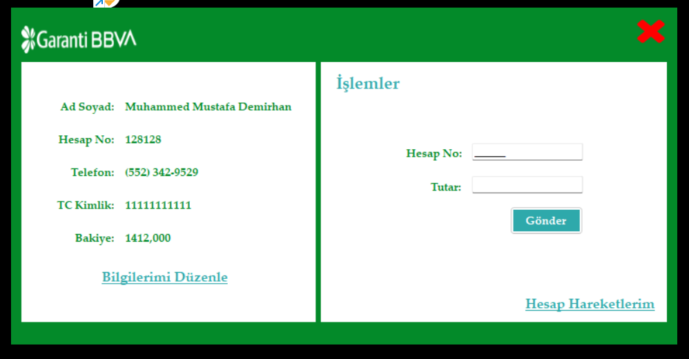
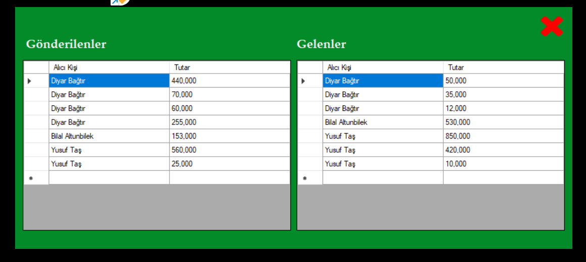

# İnternet Bankacılığı Simülasyonu
## Proje açıklaması
Bu proje müşterilerin birbirleriyle para transferi gerçekleştirebildiği bir internet bankacılığı simülasyonudur. Yeni oluşturulacak veya mevcutta olan müşterilerin verileri veritabanında saklıdır.
## Önizleme
**Giriş Ekranı**

**Ana Ekran**

**Geçmiş İşlemler**

## Kullanılan Teknolojiler
Projede aşağıdaki teknolojiler kullanılmaktadır:

- MSSQL
- C#
- .NET Framework

## Yazarlar
- [Muhammed Mustafa Demirhan](https://github.com/MuhammedMustafaDemirhan) - Projeyi geliştiren
